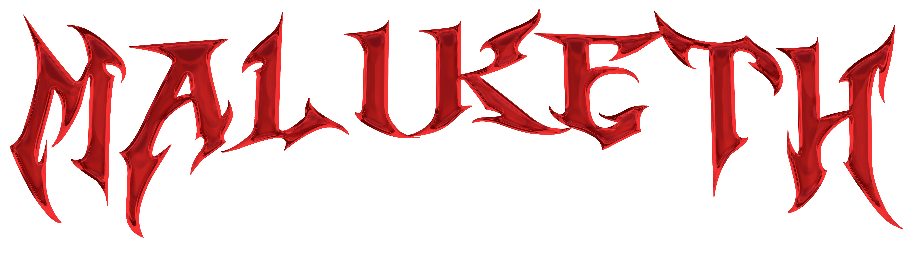
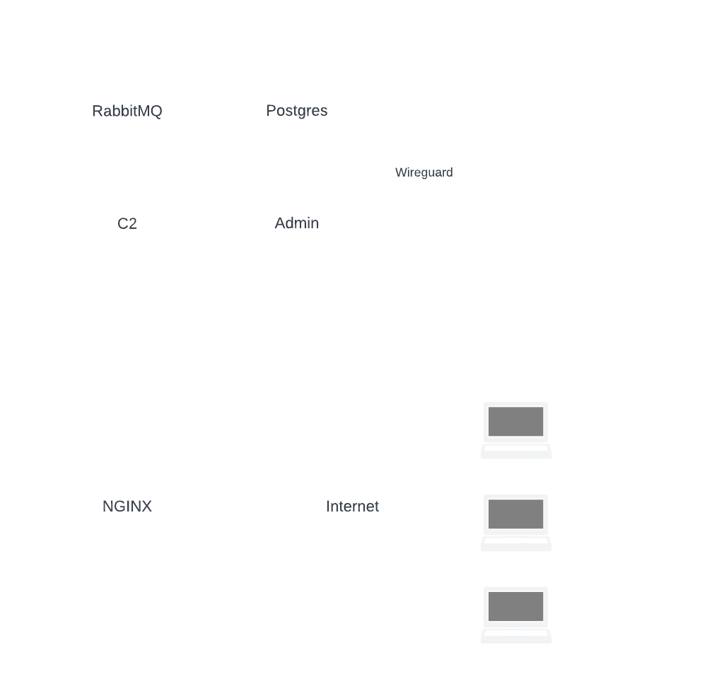

# Welcome
{: .fw-700}

## What is Maliketh?
Maliketh is a flexible, easy to use HTTPS C2 framework that can be customized to fit the needs of the operator. The main feature of the implant is its ability to change its behavior based on the configuration file it receives from the server. This allows the operator to customize the implant to fit their needs. Many configuration options can also be changed on the fly while the implant is running.

## Why Maliketh?
This project started out as a project for a class in college, but I decided to continue working on it because I wanted to learn more about C2 frameworks and how they work. Also, I was bored.

## How does it work?
Maliketh has three primary components: the C2 server, the operator client, and the implant. 

The C2 server is responsible for handling communications between the operator and the implant. It also receives commands from the client and handles implant responses.

The operator client is responsible for interacting with the implant.

The implant is the main binary to be executed on the target system. The implant is responsible for establishing a connection with the C2 server and executing commands from the operator.

Here's a basic diagram of how the components interact with each other:

## How can I contribute?
If you're interested in contributing to Maliketh, feel free to submit a pull request or open an issue. I'm always looking for ways to improve the framework.